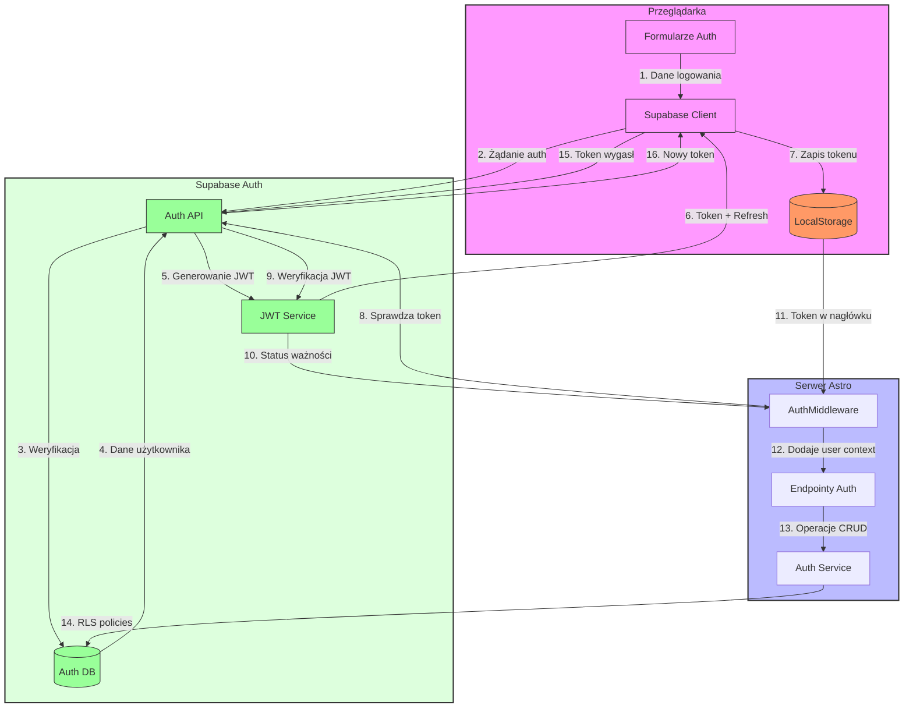

# Diagram przepływu autentykacji w 10xCards

## Legenda

### Komponenty

- **Przeglądarka**

  - UF: Formularze logowania/rejestracji/resetu hasła
  - SC: Klient Supabase do komunikacji z API
  - LS: LocalStorage przechowujący token JWT

- **Serwer Astro**

  - AM: Middleware weryfikujący sesje
  - AE: Endpointy API obsługujące auth
  - AS: Serwis autoryzacji

- **Supabase Auth**
  - SA: API autentykacji
  - JWT: Serwis tokenów JWT
  - DB: Baza danych auth

### Przepływy

1. **Logowanie/Rejestracja**

   - Krok 1-7: Od formularza do zapisu tokenu

2. **Weryfikacja Sesji**

   - Krok 8-10: Sprawdzanie ważności tokenu

3. **Dostęp do Zasobów**

   - Krok 11-14: Weryfikacja i autoryzacja operacji

4. **Odświeżanie Tokenów**
   - Krok 15-16: Automatyczne odświeżanie wygasłych tokenów
