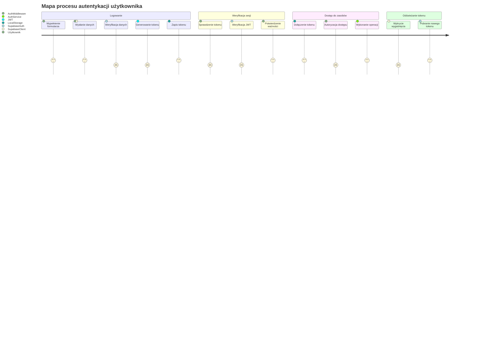

# Journey Map - Proces autentykacji w 10xCards

## Opis etapów

### Logowanie

- Użytkownik wprowadza dane logowania w formularzu
- Dane są przesyłane do Supabase przez klienta
- Supabase weryfikuje dane w bazie
- Generowany jest token JWT
- Token jest zapisywany w LocalStorage

### Weryfikacja sesji

- Middleware sprawdza obecność tokenu
- Token jest weryfikowany przez Supabase
- Middleware potwierdza ważność sesji

### Dostęp do zasobów

- Token jest dołączany do żądań
- Middleware autoryzuje dostęp
- Serwis wykonuje operacje z odpowiednimi uprawnieniami

### Odświeżanie tokenu

- Wykrycie wygaśnięcia tokenu przez klienta
- Automatyczne pobranie nowego tokenu od Supabase

## Skala satysfakcji

- 1: Problematyczne
- 2: Neutralne
- 3: Satysfakcjonujące
