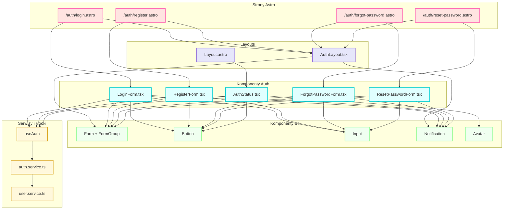

# Diagram komponentów UI - Moduł autentykacji 10xCards

## Legenda

### Strony Astro (Pages)

- `/auth/login.astro`: Strona logowania z SSR i obsługą sesji
- `/auth/register.astro`: Strona rejestracji z walidacją server-side
- `/auth/forgot-password.astro`: Strona resetowania hasła
- `/auth/reset-password.astro`: Strona zmiany hasła po resecie

### Layouts

- `Layout.astro`: Główny layout aplikacji
- `AuthLayout.tsx`: Layout dla stron autoryzacji

### Komponenty Auth

- `LoginForm.tsx`: Formularz logowania z walidacją
- `RegisterForm.tsx`: Formularz rejestracji z walidacją
- `ForgotPasswordForm.tsx`: Formularz żądania resetu hasła
- `ResetPasswordForm.tsx`: Formularz zmiany hasła
- `AuthStatus.tsx`: Komponent stanu autoryzacji

### Komponenty UI

- `Form + FormGroup`: Komponenty formularzy z Shadcn
- `Button`: Przycisk z różnymi wariantami
- `Input`: Pole wprowadzania z walidacją
- `Notification`: Komunikaty i powiadomienia
- `Avatar`: Awatar użytkownika

### Serwisy i Hooki

- `auth.service.ts`: Logika autentykacji
- `user.service.ts`: Zarządzanie profilem
- `useAuth`: Hook do stanu autoryzacji

## Przepływ danych

1. **Logowanie/Rejestracja**

   - Formularze -> AuthService -> Supabase
   - Odpowiedź -> UseAuth -> AuthStatus

2. **Stan sesji**

   - AuthService -> UseAuth -> Komponenty
   - Automatyczne odświeżanie przez AuthService

3. **Zarządzanie profilem**
   - AuthService -> UserService -> Supabase
   - Aktualizacja UI przez UseAuth
